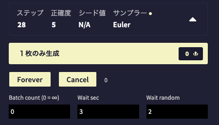

# NAI Generate Forever

NAI にバッチカウント機能を追加します。

[Naildcard](https://github.com/xmitoux/naildcard) がインストールされていたらNaildcardを実行してから生成します。

## Update

- 2024.05.22: v2.1.0
  - Naildcardを実行してから生成開始する `Forever dice` ボタンを追加
  - `Forever` ボタンはNaildcardを実行しません

## Install

1. [Release](https://github.com/da2el-ai/NAI-generate-forever/tags)から最新版のZIPをダウンロード。
2. ZIPを解凍する
3. Chromeで `chrome://extensions/` を開いて拡張機能の管理画面を開く。
4. 画面右上の `デベロッパーモード` を有効にする
5. 解凍したフォルダごとChromeにドラッグドロップする
6. NAIを開く（既に開いてるなら読み込み直す）

※解凍したファイルは削除しないでください。削除や移動をすると機能拡張がアンインストールされます

## Usage

- `Forever`ボタン
  - 画像を生成する
- `Cancel`ボタン
  - 生成を停止する
- `Batch count`
  - 生成上限枚数
  - `0` にすると `Cancel` をクリックするまで生成し続ける
- `Wait sec`
  - 次の生成までの待機時間
- `Wait random`
  - `Wait sec` に追加する待機時間の振れ幅

exp: wait sec `3` 、wait random `2` だと3〜5秒の間隔で待機する。
